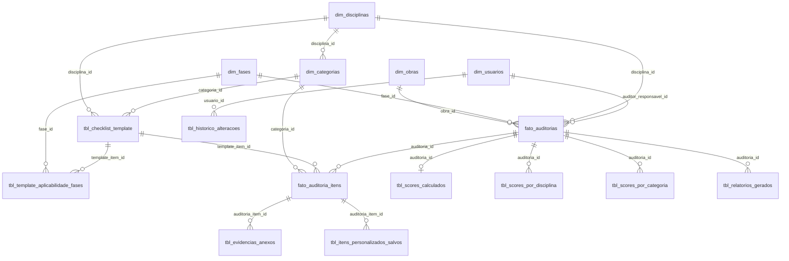

# Diagrama ER — Auditoria BIM (estrutura dimensional)

## Visão geral

O modelo possui **16 tabelas**: 5 dimensões (`dim_*`), 2 de biblioteca de templates (`tbl_checklist_template`, `tbl_template_aplicabilidade_fases`), 2 fatos transacionais (`fato_auditorias`, `fato_auditoria_itens`), 2 de anexos e itens personalizados, 1 de histórico, 3 de scores materializados e 1 de relatórios gerados.

---

## Entidades e atributos principais

| Entidade | PK | Atributos principais |
|----------|----|----------------------|
| **dim_obras** | id (UUID) | codigo (UNIQUE), nome, endereco, ativo, deleted_at |
| **dim_fases** | id (UUID) | codigo (UNIQUE), nome, descricao, ordem_sequencial, ativo |
| **dim_disciplinas** | id (UUID) | codigo (UNIQUE), nome, descricao, ativo |
| **dim_categorias** | id (UUID) | codigo, nome, disciplina_id (FK), ordem_exibicao, ativo |
| **dim_usuarios** | id (UUID) | email (UNIQUE), nome_completo, senha_hash, perfil, ativo |
| **tbl_checklist_template** | id (UUID) | versao, disciplina_id, categoria_id, item_verificacao, peso, pontos_maximo, origem, auditoria_origem_id (FK opc.) |
| **tbl_template_aplicabilidade_fases** | id (UUID) | template_item_id (FK), fase_id (FK), obrigatorio — UNIQUE(template_item_id, fase_id) |
| **fato_auditorias** | id (UUID) | codigo_auditoria (UNIQUE), obra_id, disciplina_id, fase_id, revisao, auditor_responsavel_id, status, data_inicio, ... — UNIQUE(obra_id, disciplina_id, fase_id, revisao) |
| **fato_auditoria_itens** | id (UUID) | auditoria_id, template_item_id (opc.), categoria_id, disciplina_id, item_verificacao_snapshot, status, tipo_item, ... |
| **tbl_evidencias_anexos** | id (UUID) | auditoria_item_id (FK), arquivo_nome, arquivo_url, arquivo_tipo, uploaded_por_id |
| **tbl_itens_personalizados_salvos** | id (UUID) | auditoria_item_id (FK), disciplina_id, categoria_id, item_verificacao, aprovado, promovido_template_id (opc.) |
| **tbl_historico_alteracoes** | id (UUID) | tabela_nome, registro_id, campo_nome, valor_anterior, valor_novo, acao, usuario_id, timestamp |
| **tbl_scores_calculados** | id (UUID) | auditoria_id (UNIQUE), score_geral, total_itens, total_aplicavel, pontos_obtidos, pontos_possiveis |
| **tbl_scores_por_disciplina** | id (UUID) | auditoria_id, disciplina_id — UNIQUE(auditoria_id, disciplina_id), score_disciplina, totais |
| **tbl_scores_por_categoria** | id (UUID) | auditoria_id, categoria_id — UNIQUE(auditoria_id, categoria_id), score_categoria, totais |
| **tbl_relatorios_gerados** | id (UUID) | auditoria_id, tipo_relatorio, formato, arquivo_url, snapshot_data, gerado_por_id |

---

## Relacionamentos e cardinalidades

- **dim_obras** 1 — N **fato_auditorias**
- **dim_fases** 1 — N **fato_auditorias**; N — N **tbl_checklist_template** (via **tbl_template_aplicabilidade_fases**)
- **dim_disciplinas** 1 — N **dim_categorias**, **fato_auditorias**, **fato_auditoria_itens** (desnorm.), **tbl_checklist_template**, **tbl_itens_personalizados_salvos**, **tbl_scores_por_disciplina**
- **dim_categorias** 1 — N **fato_auditoria_itens**, **tbl_checklist_template**, **tbl_itens_personalizados_salvos**, **tbl_scores_por_categoria**
- **dim_usuarios** 1 — N **fato_auditorias** (auditor_responsavel, cancelado_por), **fato_auditoria_itens** (avaliado_por), **tbl_evidencias_anexos**, **tbl_itens_personalizados_salvos** (criado_por, aprovado_por), **tbl_checklist_template** (inativado_por), **tbl_historico_alteracoes**, **tbl_relatorios_gerados**
- **tbl_checklist_template** 1 — N **fato_auditoria_itens** (template_item_id), **tbl_template_aplicabilidade_fases**; N — N **dim_fases** via **tbl_template_aplicabilidade_fases**; opc. 1 — 1 **fato_auditorias** (auditoria_origem_id)
- **fato_auditorias** 1 — N **fato_auditoria_itens**, **tbl_scores_calculados**, **tbl_scores_por_disciplina**, **tbl_scores_por_categoria**, **tbl_relatorios_gerados**
- **fato_auditoria_itens** 1 — N **tbl_evidencias_anexos**, **tbl_itens_personalizados_salvos**

---

## Chaves alternativas

- **fato_auditorias**: `(obra_id, disciplina_id, fase_id, revisao)` — chave única de negócio da auditoria.
- **tbl_template_aplicabilidade_fases**: `(template_item_id, fase_id)` — um item de template aplicável a uma fase uma vez.

---

## Diagrama Mermaid (ER simplificado)

